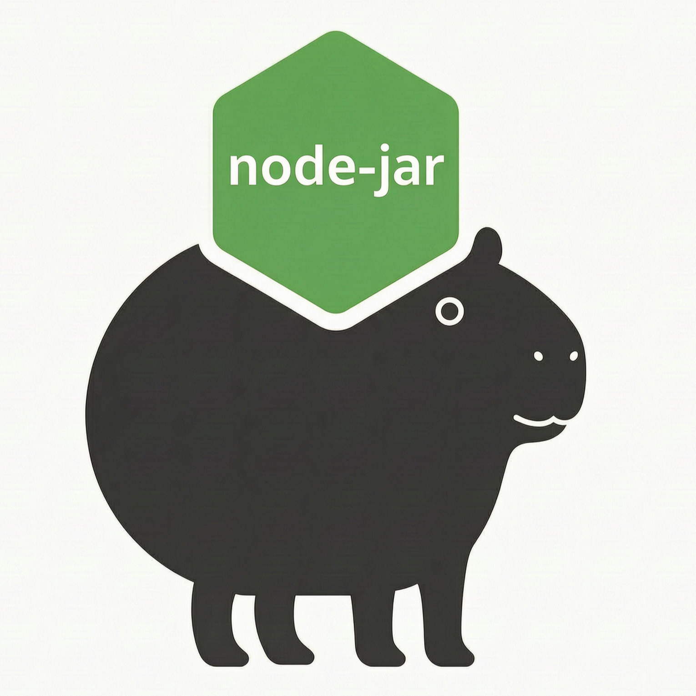

<p align="center">
  
</p>

<p align="center">
  
  
  
</p>

<h1 align="center">node-jar</h1>

<p align="center"><strong>将任何 Node.js 后端项目打包为单个可部署文件。<br>Express、NestJS、Koa、Fastify —— 无论什么框架，像维护 JAR 一样维护你的 Node.js 应用。</strong></p>

---

## 为什么要用 node-jar？

Java 有 JAR，Python 有 wheel。Node.js 呢？**在生产服务器上 `npm install`。**

传统的 Node.js 部署流程非常浪费：

```
git pull → npm install（5 分钟，500MB+）→ npm run build → pm2 restart
```

每台服务器都要下载几百 MB 的依赖 —— 哪怕你只改了一行代码。

**node-jar** 让你一次构建，到处运行：

```
npx node-jar build → scp dist/app.bundle.js → node app.bundle.js
```

| | 传统部署 | node-jar |
|---|---|---|
| **部署耗时** | 5–10 分钟 | **10 秒** |
| **服务器磁盘** | 200–500 MB | **2–20 MB** |
| **网络开销** | 下载全部依赖 | **上传一个文件** |
| **依赖漂移** | 可能发生 | **不可能**（构建时锁定） |
| **回滚** | git checkout + npm install | **替换一个文件** |
| **服务器 Node 版本** | 必须匹配 | **≥16 即可** |
| **框架支持** | 各自折腾 | **全部兼容** |

> **"但服务器还是需要装 Node.js 啊。"** —— 是的，就像 Java 需要 JVM、Python 需要解释器。安装 Node.js 是一次性操作。真正省掉的是**每次部署**都要跑的 `npm install`（网络下载 + 磁盘空间 + 依赖冲突风险）。

## 快速开始

```bash
# 1. 安装为开发依赖
npm install --save-dev node-jar

# 2. 构建你的项目（自动检测一切）
npx node-jar build

# 3. 部署产出文件
node dist/app.bundle.js
```

就这么简单。无需配置。`node-jar` 自动读取 `package.json`、找到入口文件、检测 TypeScript、打包所有依赖、产出单个文件。

## 框架兼容性

**一个工具，适配所有框架。**

`node-jar` 通过注入虚拟文件系统 Shim，拦截了 `fs.readFileSync`、`fs.statSync`、`fs.existsSync` 和 `fs.readdirSync` —— 这四个函数是所有 Node.js 框架静态文件中间件的底层依赖。这意味着你的框架**无需任何修改**即可工作。

| 框架 | 静态文件 | 模板引擎 | TypeScript | ORM |
|---|---|---|---|---|
| **Express** | `express.static` → VFS | EJS / Pug / Handlebars | 可选 | 纯 JS ORM |
| **NestJS** | `@nestjs/serve-static` → VFS | — | esbuild 编译 | TypeORM / Prisma |
| **Koa** | `koa-static` → VFS | — | 可选 | 纯 JS ORM |
| **Fastify** | `@fastify/static` → VFS | — | 可选 | 纯 JS ORM |
| **Hapi** | `@hapi/inert` → VFS | — | 可选 | 纯 JS ORM |
| **Egg.js** | `egg-static` → VFS | Nunjucks / EJS | 可选 | 纯 JS ORM |

**背后的原理**：所有框架的静态文件中间件归根结底都在调用 `fs.readFileSync`。Hook 了它，所有框架自动适配。

### 数据库驱动

纯 JavaScript 驱动直接打包，不依赖原生编译：

- **MySQL** → `mysql2`（纯 JS 模式）
- **PostgreSQL** → `pg`（纯 JS）
- **Redis** → `ioredis`（纯 JS）
- **MongoDB** → `mongodb`（kerberos 可选原生）

需要 C/C++ 原生编译的模块（`bcrypt`、`sharp`、`sqlite3`），见[原生模块](#原生模块)章节。

## CLI 用法

```bash
# 零配置：自动检测项目类型，开箱即用
npx node-jar build

# 全配置：适合高级场景
npx node-jar build \
  --entry src/main.ts \
  --output dist/app.bundle.js \
  --tsconfig tsconfig.build.json \
  --obfuscate \
  --encrypt \
  --encrypt-key env \
  --static public,templates \
  --externals sharp,bcrypt \
  --no-minify
```

### 参数说明

| 参数 | 说明 | 默认值 |
|---|---|---|
| `-e, --entry <path>` | 入口文件路径 | 自动从 `package.json` 检测 |
| `-o, --output <path>` | 输出文件路径 | `dist/app.bundle.js` |
| `--tsconfig <path>` | TypeScript 配置文件 | 自动检测 |
| `--obfuscate` | 启用代码混淆 | `false` |
| `--encrypt` | 启用 AES-256-CBC 加密 | `false` |
| `--encrypt-key <type>` | 密钥来源: `env`、`file:<path>` 或自定义字符串 | `env` |
| `--static <dirs...>` | 额外需要嵌入的静态目录 | `public,static,assets`（如存在） |
| `--externals <pkgs...>` | 保持为外部 `require()` 的包 | `[]` |
| `--no-minify` | 禁用压缩（调试用） | 默认压缩 |
| `-c, --config <path>` | 配置文件路径 | 自动检测 |
| `-q, --quiet` | 静默模式，仅输出错误 | `false` |

## JS API

```js
const { build } = require('node-jar');

// 零配置
await build();

// 完整配置
const result = await build({
  entry: 'src/main.ts',
  output: 'dist/app.bundle.js',
  obfuscate: true,
  encrypt: true,
  static: ['public', 'templates'],
  externals: ['sharp'],
});

console.log(result.stats);
// {
//   originalSize: 234567,
//   finalSize: 187654,
//   assetCount: 12,
//   nativeModules: [],
//   obfuscated: true,
//   encrypted: true,
//   framework: 'nestjs',
//   hasTS: true
// }
```

## 配置文件

在项目根目录创建 `node-jar.config.js`（或 `.json`）：

```js
module.exports = {
  entry: 'src/main.ts',
  output: 'dist/app.bundle.js',
  obfuscate: true,
  encrypt: false,
  static: ['public', 'templates'],
  externals: ['sharp'],
};
```

配置文件自动加载，CLI 参数优先级高于配置文件。

## 工作原理

```
                    [0. 项目检测与预处理]
                              │
         ┌────────────────────┼────────────────────┐
         │ TypeScript 项目     │ JavaScript 项目     │
         │ esbuild → CJS      │ 直接使用            │
         └────────────────────┴────────────────────┘
                              │
                              ▼
                    [1. NCC 依赖打包]
                 所有依赖 + 入口 → 单文件 JS
                              │
                              ▼
                    [2. 资源嵌入]
                 静态文件 / 配置 / 模板
                  → Base64 → 虚拟文件系统 Shim
                              │
                              ▼
                    [3. 代码保护]
                  A 层: 混淆（可选）
                  B 层: AES-256-CBC 加密（可选）
                              │
                              ▼
                    [4. 引导封装]
                  [VFS Shim] → [解密?] → [应用代码]
                              │
                              ▼
                       app.bundle.js
```

### 阶段 0 —— 项目检测

自动扫描项目并配置：
- 检测 TypeScript 依赖 → 自动启用 esbuild 编译
- 读取 `tsconfig.json` → 获取编译选项与路径别名
- 检测 `"type": "module"` → 识别 ESM 模式
- 检测框架标识（`@nestjs/core`、`express`、`koa` 等）→ 输出日志提示

### 阶段 1 —— 依赖打包（`@vercel/ncc`）

将入口文件 + 整个 `node_modules` 依赖树编译为单个自包含的 JavaScript 文件：
- Tree-shaking：移除未使用的代码
- Scope hoisting：合并模块作用域
- Minification：压缩输出体积

### 阶段 2 —— 虚拟文件系统

收集非 JS 资源并注入 `fs` Monkey-patch：

- **静态文件**: `public/`、`static/`、`assets/`、`dist/client/`、`build/`
- **配置文件**: `.env`、`.env.production`、`config/*.json`、`ormconfig.json`
- **模板文件**: `views/*.hbs`、`views/*.ejs`、`templates/*`
- **Schema 文件**: `*.proto`、`*.graphql`、`prisma/schema.prisma`

全部以 Base64 编码嵌入 bundle。VFS Shim 拦截 `readFileSync`、`statSync`、`existsSync`、`readdirSync`，让框架从内存读取文件而非磁盘 —— 无需改动一行框架代码。

### 阶段 3 —— 代码保护（可选）

| 层级 | 触发条件 | 保护强度 | 性能影响 |
|---|---|---|---|
| **A: 混淆** | `--obfuscate` | 控制流平坦化 + 字符串编码 + 死代码注入 | 构建 +30s；运行时 +5~15% |
| **B: 加密** | `--encrypt` | AES-256-CBC 整包加密 | 启动 +50~200ms（一次性解密） |

两层可叠加，获取最强保护。

## 原生模块

C/C++ 扩展（`.node` 文件）无法嵌入纯 JS bundle。`node-jar` 自动检测并启用 **sidecar 模式**：

```
dist/
├── app.bundle.js        # 主体（纯 JS 部分）
└── package.json         # Sidecar —— 仅原生依赖（3–5行）
```

含原生模块时的部署步骤：

```bash
# 上传 dist/ 目录到服务器
scp -r dist/ server:/opt/app/

# 在服务器上 —— 仅安装原生依赖（几秒完成）
cd /opt/app && npm install --production

# 运行
node app.bundle.js
```

### Prisma 特殊处理

Prisma 的 Query Engine 是原生二进制。`node-jar` 自动检测 `@prisma/client` → 加入 externals → sidecar 模式。

| 场景 | 包名 | 处理方式 |
|---|---|---|
| 纯 JS | `mysql2`、`pg`、`ioredis`、`redis` | 直接打包 |
| 可选原生 | `mongodb`(kerberos)、`mysql2`(native) | 走纯 JS 路径，直接打包 |
| 强依赖原生 | `bcrypt`、`sharp`、`sqlite3` | Sidecar 模式 |
| ORM 包装的原生 | TypeORM + `sqlite3`、Prisma 引擎 | 自动检测 → Sidecar |

## 实际部署效果

**传统部署流程**：
```
$ ssh server
$ cd /opt/app && git pull
$ npm install        # 5 分钟，500MB
$ npm run build      # 2 分钟
$ pm2 restart myapp
```

**node-jar 部署流程**：
```
$ npx node-jar build --obfuscate
$ scp dist/app.bundle.js server:/opt/app/
$ ssh server "pm2 restart myapp"
```

10 秒。一个文件。没有意外。

## 环境要求

- **构建环境**: Node.js ≥ 16.0.0，需执行 `npm install`（一次性）
- **运行环境**: 目标服务器需安装 Node.js ≥ 16.0.0
- **可选依赖**: `javascript-obfuscator`（`npm install -D javascript-obfuscator`）启用代码混淆

## License

MIT © 慕落 （muluo mingzhema）

---

<p align="center"><em>"把你的 Node.js 应用当 JAR 包发。500MB 的 node_modules 属于你的 CI 服务器，不该出现在生产环境。"</em></p>
